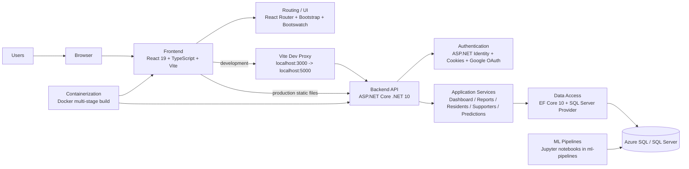

# Intex Group 1-9

## Tech Stack Diagram

## Stack Summary

- Frontend: React 19, TypeScript, Vite, React Router, Bootstrap, Bootswatch
- Backend: ASP.NET Core on .NET 10
- Auth: ASP.NET Identity, cookie auth, optional Google OAuth
- Data: Entity Framework Core 10 with SQL Server
- Database: Azure SQL / SQL Server via `AppConnection`
- API Docs: Swagger / Swashbuckle
- Config: `DotNetEnv` for local environment variables
- ML: notebook-based pipelines in [`ml-pipelines`](./ml-pipelines)
- Deployment: Docker multi-stage build with frontend bundled into backend `wwwroot`

## Project Structure

- [`frontend`](./frontend): React client app
- [`backend/Intex.API`](./backend/Intex.API): ASP.NET Core API and Identity setup
- [`ml-pipelines`](./ml-pipelines): machine learning notebooks and experiments
- [`Dockerfile`](./Dockerfile): production container build

## Runtime Architecture

- In development, Vite runs on `http://localhost:3000` and proxies `/api` requests to `https://localhost:5000`.
- In production, the React app is built and served by the ASP.NET Core app from `wwwroot`.
- Both application data and Identity currently connect through the same SQL Server connection string.
