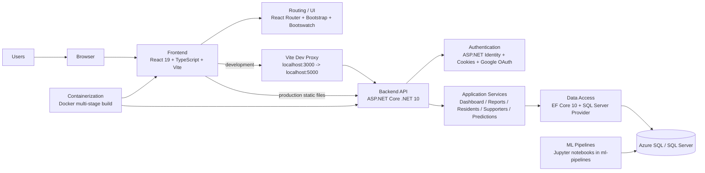

# Intex Group 1-9

## Tech Stack Diagram



## Stack Summary

- Frontend: React 19, TypeScript, Vite, React Router, Bootstrap, Bootswatch
- Backend: ASP.NET Core on .NET 10
- Auth: ASP.NET Identity, cookie auth, optional Google OAuth
- Data: Entity Framework Core 10 with SQL Server
- Database: Azure SQL / SQL Server via `AppConnection`
- API Docs: Swagger / Swashbuckle
- Config: `DotNetEnv` for local environment variables
- ML: notebook-based pipelines in [`ml-pipelines`](./ml-pipelines)
- Deployment: Azure Static Web Apps for the frontend and Azure App Service for the API in production; Docker remains available for the combined app build

## Project Structure

- [`frontend`](./frontend): React client app
- [`backend/Intex.API`](./backend/Intex.API): ASP.NET Core API and Identity setup
- [`ml-pipelines`](./ml-pipelines): machine learning notebooks and experiments
- [`Dockerfile`](./Dockerfile): production container build

## Runtime Architecture

- In development, Vite runs on `http://localhost:3000` and proxies `/api` requests to `https://localhost:5000`.
- In production, the frontend is deployed separately to Azure Static Web Apps and calls the ASP.NET Core API over HTTPS using the origin configured in [`frontend/.env.production`](./frontend/.env.production).
- The live public frontend and API are expected to terminate TLS with Microsoft-managed certificates on their Azure hostnames.
- Both application data and Identity currently connect through the same SQL Server connection string.

## Python Runtime Without Docker Rebuilds

The API can run the donor churn Python script directly using the App Service system Python.

- Python executable is configured through `DonorChurnInference:PythonExecutablePath`.
- Script is configured through `DonorChurnInference:ScriptPath`.
- Python dependencies are loaded from `DonorChurnInference:PythonPackagesPath` (wired to `PYTHONPATH` by the API before process start).

Default settings are already configured in [`backend/Intex.API/appsettings.json`](./backend/Intex.API/appsettings.json):

- `PythonExecutablePath`: `/usr/bin/python3`
- `ScriptPath`: `ml-runtime/run_donor_churn_inference.py`
- `PythonPackagesPath`: `ml-runtime/python-packages`

Install dependencies into the target folder with:

```bash
cd backend/Intex.API/ml-runtime
chmod +x install_python_packages.sh
./install_python_packages.sh
```

For Azure App Service Linux, run the equivalent command in a startup step or deployment script:

```bash
python3 -m pip install --upgrade --target /home/site/wwwroot/ml-runtime/python-packages -r /home/site/wwwroot/ml-runtime/requirements.txt
```

This avoids global pip installs and works with PEP 668 restrictions.

## Container Deployment (Azure)

This project is set up to deploy as a single Docker container. The image build:

- compiles the backend API,
- builds the frontend and copies it into `wwwroot`,
- installs Python + ODBC runtime dependencies,
- installs ML dependencies from `backend/Intex.API/ml-runtime/requirements.txt`.

### 1. Prerequisites

- Azure subscription
- Azure CLI installed and logged in (`az login`)
- Docker installed and running

### 2. Build and Push the Image

Use Azure Container Registry (ACR):

```bash
# Variables
RG=<resource-group>
LOCATION=<location>
ACR_NAME=<unique-acr-name>
IMAGE_NAME=intex-api
IMAGE_TAG=latest

# Create resource group and ACR (if needed)
az group create --name $RG --location $LOCATION
az acr create --resource-group $RG --name $ACR_NAME --sku Basic

# Build and push via ACR Tasks
az acr build --registry $ACR_NAME --image $IMAGE_NAME:$IMAGE_TAG .
```

### 3. Deploy to Azure App Service (Container)

```bash
APP_NAME=<unique-app-name>
PLAN_NAME=<app-service-plan-name>

# Create Linux App Service plan
az appservice plan create --resource-group $RG --name $PLAN_NAME --is-linux --sku B1

# Create web app configured for your container image
az webapp create \
    --resource-group $RG \
    --plan $PLAN_NAME \
    --name $APP_NAME \
    --deployment-container-image-name $ACR_NAME.azurecr.io/$IMAGE_NAME:$IMAGE_TAG

# Allow App Service to pull from ACR
az webapp config container set \
    --resource-group $RG \
    --name $APP_NAME \
    --container-image-name $ACR_NAME.azurecr.io/$IMAGE_NAME:$IMAGE_TAG \
    --container-registry-url https://$ACR_NAME.azurecr.io
```

### 4. Required App Settings

Set these in App Service Configuration:

```bash
az webapp config appsettings set \
    --resource-group $RG \
    --name $APP_NAME \
    --settings \
        ConnectionStrings__AppConnection="<your-sql-connection-string>" \
        ASPNETCORE_ENVIRONMENT="Production" \
        FrontendUrl="https://$APP_NAME.azurewebsites.net"
```

If needed, override inference settings explicitly:

```bash
az webapp config appsettings set \
    --resource-group $RG \
    --name $APP_NAME \
    --settings \
        DonorChurnInference__PythonExecutablePath="/usr/bin/python3" \
        DonorChurnInference__ScriptPath="ml-runtime/run_donor_churn_inference.py" \
        DonorChurnInference__WorkingDirectory="." \
        DonorChurnInference__TimeoutSeconds="300"
```

### 5. Verify

After deployment:

1. Sign in as an admin user.
2. Open the donors admin page.
3. Click **Run Churn Inference**.
4. Confirm success message and updated donor churn data.

You can also inspect container logs:

```bash
az webapp log tail --resource-group $RG --name $APP_NAME
```
