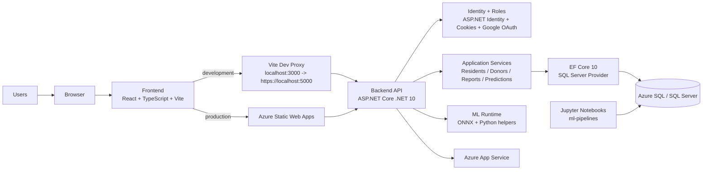

# Intex Group 1-9

New Dawn is a full-stack nonprofit operations platform for managing residents, donors, field activity, reporting, and ML-assisted decision support. The repo combines a public-facing React site, an authenticated admin portal, an ASP.NET Core API, Azure SQL-backed data access, and notebook/model assets used for inference workflows.

## What This Project Does

The application supports three broad areas:

- Public web experience for the organization website, impact storytelling, programs, donation messaging, privacy/cookie pages, and registration/login.
- Admin operations for residents, donors, partners, reports, social media analytics, process recordings, home visitations, and case-related workflows.
- Machine-learning assisted reporting and scoring for donor churn, donor upsell, reintegration readiness, intervention effectiveness, social media donation performance, and resident risk.

## Main Product Areas

### Public Experience

- Landing, About, Programs, Donate, Get Involved
- Public impact dashboard
- Authentication entry points and donor registration
- Privacy policy and cookie policy

### Authenticated Experience

- Admin dashboard
- Resident caseload list and resident detail pages
- Donor list, donor detail, and donor self-service history
- Reports and inference dashboards
- Partners and social media pages
- Dedicated process recording and home visitation admin pages
- MFA management page for signed-in users

### Resident Workflow Highlights

- `/admin/residents` uses a dedicated create contract and server-generated identifiers.
- The API generates `resident_id`, `case_control_no`, and `internal_code` during resident creation.
- Resident-derived fields such as `age_upon_admission`, `present_age`, and `length_of_stay` are computed on the server.
- The resident detail page supports inline CRUD for:
  - process recordings
  - home visitations
  - case conferences
- Resident deletion removes known dependent rows in application code before deleting the resident record.

## Architecture



## Tech Stack

### Frontend

- React 19
- TypeScript
- Vite
- React Router
- Bootstrap + Bootswatch
- Recharts

### Backend

- ASP.NET Core on .NET 10
- ASP.NET Identity API endpoints
- Entity Framework Core 10
- SQL Server provider
- Google OAuth support when credentials are configured

### Data and ML

- Azure SQL / SQL Server
- ONNX models served by the API
- Python helper scripts for donor churn inference
- Jupyter notebooks in `ml-pipelines`

### Tooling and Deployment

- npm / Vite for frontend builds
- `dotnet` CLI for backend and solution builds
- Azure Static Web Apps GitHub Action for the frontend
- Azure App Service for the production API

## Repository Structure

- [`frontend`](./frontend): React client application
- [`backend/Intex.API`](./backend/Intex.API): ASP.NET Core API, Identity setup, EF Core contexts, controllers, services, ML runtime assets
- [`ml-pipelines`](./ml-pipelines): notebooks and model-development work
- [`.github/workflows`](./.github/workflows): deployment workflow for the frontend
- [`DatabaseKeys.md`](./DatabaseKeys.md): table/field reference notes
- [`TablesColumns.md`](./TablesColumns.md): database schema summary
- [`Security.md`](./Security.md): security-related notes and policies

## Local Development

### Prerequisites

- Node.js 20+ recommended
- npm
- .NET SDK 10
- Access to a SQL Server or Azure SQL database compatible with the mapped schema

### Configuration Overview

The app reads configuration from both `appsettings*.json` and environment variables.

Important configuration locations:

- [`backend/Intex.API/appsettings.json`](./backend/Intex.API/appsettings.json)
- [`backend/Intex.API/appsettings.Development.json`](./backend/Intex.API/appsettings.Development.json)
- [`backend/Intex.API/.env`](./backend/Intex.API/.env)
- [`frontend/.env`](./frontend/.env)
- [`frontend/.env.development`](./frontend/.env.development)
- [`frontend/.env.production`](./frontend/.env.production)

### Backend Configuration

At minimum, the backend needs:

- `ConnectionStrings__AppConnection`
- `GenerateDefaultIdentityAdmin__Password`
- `GenerateDefaultIdentityDonor__Password`
- `GenerateDefaultIdentityMfa__Password`

Optional configuration includes:

- `Authentication__Google__ClientId`
- `Authentication__Google__ClientSecret`
- `FrontendUrl` or `FrontendUrls`

Important caveat:

- The current backend is wired for SQL Server via `UseSqlServer(...)`.
- [`backend/Intex.API/appsettings.Development.json`](./backend/Intex.API/appsettings.Development.json) still contains SQLite-style placeholder values and is not sufficient by itself for the current runtime.
- In practice, local development should provide a valid SQL Server connection string through environment variables, typically via [`backend/Intex.API/.env`](./backend/Intex.API/.env).

### Frontend Configuration

Frontend API behavior is controlled by `VITE_API_BASE_URL`:

- In development, leave `VITE_API_BASE_URL` empty to use the Vite `/api` proxy.
- In production, set `VITE_API_BASE_URL` to the deployed backend origin.

The Vite dev server defaults to:

- frontend: `http://localhost:3000`
- proxied backend target: `https://localhost:5000`

If your backend runs on a different URL, set `VITE_API_PROXY_TARGET` when starting Vite or update [`frontend/vite.config.ts`](./frontend/vite.config.ts).

### Install Dependencies

Frontend:

```bash
cd frontend
npm install
```

Backend:

```bash
cd backend/Intex.API
dotnet restore
```

### Run the App

Start the API:

```bash
cd backend/Intex.API
dotnet run
```

Default backend launch URLs come from [`backend/Intex.API/Properties/launchSettings.json`](./backend/Intex.API/Properties/launchSettings.json):

- `https://localhost:5000`
- `http://localhost:4000`

Start the frontend in a second terminal:

```bash
cd frontend
npm run dev
```

Then open:

- `http://localhost:3000`

## Authentication and Seeded Users

On startup, the API:

- applies EF migrations when possible
- verifies DB connectivity if migrations cannot run because the snapshot is out of sync
- seeds Identity roles
- seeds default users when the relevant config values are present

Roles:

- `Admin`
- `Donor`

Seeded emails come from [`backend/Intex.API/appsettings.json`](./backend/Intex.API/appsettings.json):

- `admin@intex.local`
- `donor@intex.local`
- `mfa@intex.local`

Passwords are expected from environment/config and should not be hard-coded into documentation.

The seeded donor flow also creates a linked supporter record and sample donation history when needed.

## Resident and Case Data Notes

The resident workflow is one of the more opinionated parts of the app.

- Resident creation uses `GET /api/residents/form-options` plus `POST /api/residents`.
- The backend generates `resident_id`, `case_control_no`, and `internal_code`.
- `date_enrolled` is derived from `date_of_admission`.
- `pwd_type` is cleared when `is_pwd = false`.
- `special_needs_diagnosis` is cleared when `has_special_needs = false`.
- Resident detail editing uses dedicated DTOs instead of posting full entity graphs.
- Process recordings and home visitations are edited through nested resident endpoints:
  - `PUT /api/residents/{id}/recordings/{recordingId}`
  - `PUT /api/residents/{id}/visitations/{visitationId}`

For home visitations, the current app vocabulary is:

- cooperation level: `Highly Cooperative`, `Cooperative`, `Neutral`, `Uncooperative`
- outcome: `Favorable`, `Needs Improvement`, `Unfavorable`, `Inconclusive`

The resident detail page normalizes older visitation labels during edit so legacy rows can still be saved through the current UI.

## API Overview

Controller coverage currently includes:

- authentication
- dashboard
- residents
- supporters / donors
- reports
- predictions
- partners
- public content
- process recordings through the resident controller
- home visitations through both resident-scoped and standalone visitation routes
- case conferences
- social media

The frontend primarily talks to the backend under `/api`.

## ML Runtime

The API includes checked-in model/runtime assets under [`backend/Intex.API/ml-runtime`](./backend/Intex.API/ml-runtime).

Included assets currently cover:

- donor churn
- donor upsell
- reintegration readiness
- intervention effectiveness
- social media donations
- resident risk

Python dependencies are listed in [`backend/Intex.API/ml-runtime/requirements.txt`](./backend/Intex.API/ml-runtime/requirements.txt).

The repo also contains notebook workflows in [`ml-pipelines`](./ml-pipelines) for feature engineering, training, evaluation, and model iteration.

## Useful Commands

Frontend dev server:

```bash
cd frontend
npm run dev
```

Frontend build:

```bash
cd frontend
npm run build
```

Frontend typecheck:

```bash
cd frontend
npx tsc -p tsconfig.app.json --noEmit
```

Backend build:

```bash
dotnet build backend/Intex.API/Intex.API.csproj
```

Whole solution build:

```bash
dotnet build IntexGroup1-9.sln
```

## Deployment Notes

Current deployment shape in this repo is split:

- frontend: Azure Static Web Apps
- backend: Azure App Service

The checked-in GitHub Actions workflow is:

- [`.github/workflows/azure-static-web-apps-purple-cliff-0b1b2f303.yml`](./.github/workflows/azure-static-web-apps-purple-cliff-0b1b2f303.yml)

That workflow deploys the frontend from the `prod` branch. Production API traffic is expected to go to a separately deployed ASP.NET Core host, and the frontend production base URL is configured in [`frontend/.env.production`](./frontend/.env.production).

There is currently no root `Dockerfile` checked into this repository, so container build instructions should not assume one exists.

## Troubleshooting

### Backend fails on startup

Check:

- `ConnectionStrings__AppConnection` points to a reachable SQL Server/Azure SQL instance
- the schema matches the mapped EF model closely enough for startup migration/connectivity checks
- the backend is allowed to bind to `https://localhost:5000`

### Frontend cannot reach the API in development

Check:

- the backend is running on `https://localhost:5000`, or
- `VITE_API_PROXY_TARGET` is set correctly for your API host

### Authentication or cookie/CORS issues

Check:

- the frontend origin matches `FrontendUrl` / `FrontendUrls`
- frontend and backend are both being accessed over compatible localhost origins
- production cookie settings require HTTPS

### Resident delete fails

The delete endpoint removes known dependent records first. If the database has additional foreign-key references not modeled in the API, resident delete can still be blocked and should be handled by adding that dependency to the delete workflow.

## Current Gaps / Notes

- No root Docker build file is present even though older documentation may have implied one.
- Some database/reference docs in the repo reflect legacy terminology; the running app now normalizes several resident/home-visitation values in code.
- The repo currently favors operational builds and manual verification. There is no broad automated test suite documented here yet.
